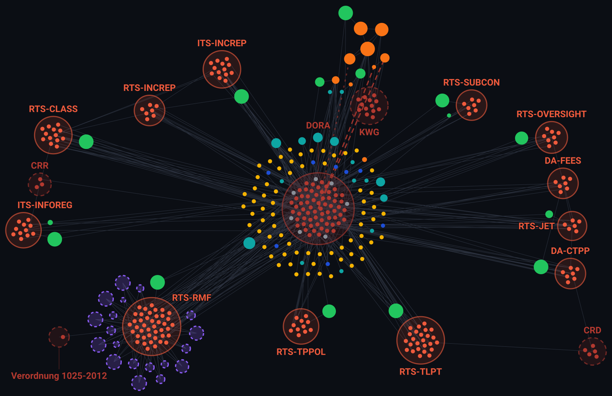
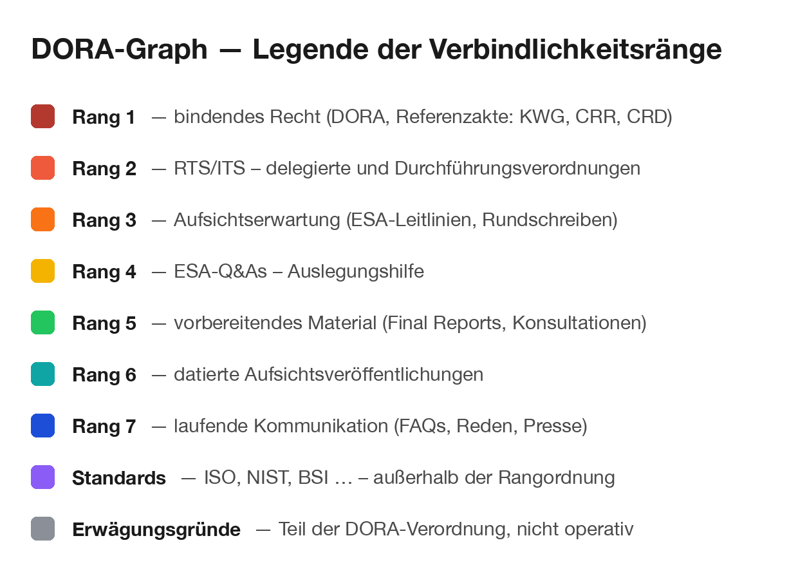

# dora-graph

**English summary.** An animated map of the EU DORA regulation (Regulation (EU) 2022/2554) and the documents around it: the regulation and its articles, the delegated and implementing acts, supervisory guidelines, ESA Q&As, preparatory final reports, German supervisory circulars and the referenced standards. Nodes are coloured by how binding a source is, sized indicatively, and placed on the timeline by when the instrument first appeared. **It is a schematic, indicative picture — not to scale and not complete — drawn from the vantage point of a German credit institution:** the national layer shows BaFin, KWG, MaRisk and BAIT, not other member states' supervisors. This repository holds the generator code, the graph metadata with links to the publishers' originals, and the built page. It mirrors no legal text. Unofficial, not legal advice, not affiliated with the ESAs, BaFin or the EU.

**Live:** [Die Geburt einer Regulatorik-Galaxie](https://gnosifex.github.io/dora-graph/)

[](https://gnosifex.github.io/dora-graph/)

---

## Was das ist

Die DORA-Regulatorik ist kein Dokument, sondern ein Geflecht: Die Verordnung verweist auf sich selbst und auf fremdes Recht, zwölf delegierte und Durchführungsverordnungen konkretisieren einzelne Artikel, Leitlinien und Q&As legen aus, Final Reports gehen den Rechtsakten voraus, nationale Rundschreiben und externe Standards hängen daran. Diese Seite zeigt das Geflecht als Graph und spielt seine Entstehung als Zeitraffer ab.

**Die Darstellung ist indikativ und schematisch.** Sie zeigt Struktur und Abfolge — nicht Maßstab, nicht Vollständigkeit. Weder die Größen noch die Zeitpunkte taugen als Messwerte; beide sind Näherungen, die das Bild lesbar machen sollen. Und sie umfasst genau das, was bei der Analyse des Korpus einen Bezug zu DORA erkennen ließ: nicht den Rechtsbestand, sondern seinen DORA-Ausschnitt — gesehen aus der Perspektive eines deutschen Kreditinstituts. Die nationale Ebene sind deshalb BaFin, KWG, MaRisk und BAIT; andere Mitgliedstaaten und Sektoren bleiben außen vor.

## Wie das Bild zu lesen ist

- **Kreise sind Rechtsakte.** Die Artikel, Anhänge und Paragrafen eines Akts liegen in seinem Kreis. Die Kreise stehen nebeneinander, nicht ineinander — Beziehungen zwischen Akten laufen ausschließlich über Kanten.
- **Farbe ist Verbindlichkeit,** nicht Wichtigkeit: Tiefrot bindendes Recht, darüber die Skala bis Blau für laufende Aufsichtskommunikation, Violett die Standards außerhalb der Rangordnung. Die Skala folgt der Quellenhierarchie des zugrunde liegenden Korpus.
- **Größe ist indikativ, kein Maßstab.** Bei eigenständigen Dokumenten folgt sie dem Textumfang. Der Kreis eines Rechtsakts dagegen richtet sich nach der Zahl seiner *gespiegelten* Einheiten: CRR und CRD sind in Wirklichkeit erheblich umfangreicher als DORA, erscheinen hier aber klein, weil vom CRR nur drei und von der CRD nur fünf Artikel im Korpus liegen. Zusätzlich ist die Größe der freien Dokumente gedeckelt, damit kein Dokument größer wirkt als ein Rechtsakt. Größen sind deshalb innerhalb einer Klasse vergleichbar, über Klassen hinweg nicht. Einzelne Artikel, Q&As und Aufsichtsseiten sind einheitlich klein, damit die Ebene der Einzelnormen nicht mit der Ebene der Dokumente konkurriert.
- **Gestrichelte Ränder markieren non-DORA-Material** — Recht und Standards außerhalb des DORA-Regelwerks: teils von ihm referenziert (CRR, CRD, Normungs-VO; die Standards über angeordnete Betrachtung), teils Rechtsgrundlage seiner nationalen Schicht, ohne selbst verwiesen zu werden (das KWG, das MaRisk und BAIT konkretisieren). Beides liegt nur ausschnittsweise oder als Stub im Korpus — der Umfang ist hochgerechnet (Rechtsakte) bzw. aus der Seitenzahl geschätzt (Standards).
- **Rote Strichlinien sind Verdrängung:** lang gestrichelt vollständig aufgehoben, fein gepunktet teilweise überholt — der sichtbarste Effekt von DORA auf die vorherige Aufsichtspraxis.
- **Der Zeitpunkt ist indikativ:** maßgeblich ist das Erscheinen der *ersten* Fassung eines Instruments, nicht das Datum der gespiegelten Novelle, und wo ein Erstfassungsdatum fehlt, steht eine Näherung. Die Abfolge stimmt, das einzelne Datum ist kein Beleg. Bestand vor 2006 ist ab dem ersten Frame sichtbar; beim Erscheinen von DORA im Dezember 2022 rückt er nach außen.

Ein Klick auf eine Legendenzeile hebt die Knoten dieses Rangs hervor.



## Was hier liegt — und was nicht

Dieses Repository enthält **keinen gespiegelten Rechtstext**. `data/graph.json` führt je Knoten nur Titel, Datum, Rang, Umfangskennzahl und die **Quell-URL beim Herausgeber**; die Volltexte bleiben dort, wo sie hingehören — bei EUR-Lex, den ESAs und der BaFin. `LINKS.md` ist derselbe Bestand als durchsuchbare Liste.

Die Metadaten stammen aus einem nicht-öffentlichen DORA-Korpus. Dies ist dessen zweites Spin-off — neben [esa-qa-mirror](https://github.com/gnosifex/esa-qa-mirror), dem Markdown-Spiegel der aufsichtlichen Q&As.

## Erzeugungskette

```
Korpus  -->  Metadaten-Export  -->  data/graph.json      (im Korpus-Projekt, nicht hier)
                                          |
                          build_site.py   |   make_links.py
                                  v       v
                        docs/index.html  ·  LINKS.md     (dieses Repo)
```

`data/graph.json` kommt fertig aus dem Korpus-Projekt; alles ab dort ist mit dem Inhalt dieses Repos vollständig nachvollziehbar:

```bash
python3 generator/build_site.py && python3 generator/check_site.py
```

Die Skripte laufen mit der Python-Standardbibliothek, ohne Abhängigkeiten und ohne Netz. Ein Bau ist deterministisch: gleiche Eingabedatei, gleiche Ausgabebytes.

`docs/preview.svg` — das Standbild oben — entsteht im selben Lauf aus denselben Layout-Daten und kann deshalb nicht veralten. Die beiden Rasterfassungen sind daraus abgeleitet, für Zwecke, die kein SVG annehmen (`docs/social-preview.png` ist die 1280 × 640 große Karte für die Repo-Einstellungen):

```bash
rsvg-convert -w 1600 docs/preview.svg -o docs/preview.png
```

## Annahmen und Grenzen

Der Graph ist eine Darstellung, kein Nachschlagewerk — mehrere Kanten und Werte sind bewusst gesetzt, weil die Daten sie nicht hergeben:

- **Kuratierte Kanten.** Dass ein Final Report seinen RTS vorbereitet, dass MaRisk und BAIT das KWG konkretisieren und EBA-Leitlinien umsetzen, dass DORA sie verdrängt: Nichts davon steht als maschinenlesbare Beziehung in den Quellen. Diese Kanten sind aus den Dokumenttiteln und dem Aufhebungsstand kuratiert.
- **Datumsannahmen.** Maßstab ist die Reihenfolge, nicht das exakte Datum. Wo eine Erstfassung nicht datiert vorliegt, steht eine plausible Näherung; die ISO-27000-Familie ist über ihre BS-7799-Vorläufer datiert.
- **Umfangsschätzungen.** Teilweise gespiegelte Akte sind über den mittleren Umfang ihrer gespiegelten Einheiten hochgerechnet, Standards über ihre Seitenzahl geschätzt. Beide tragen den gestrichelten Rand.
- **Gezeigt wird, was mit DORA-Bezug zutage trat.** Das Bild bildet den Ausschnitt ab, der bei der Analyse des Korpus einen Bezug zu DORA erkennen ließ — nicht den vollständigen Rechtsbestand. Von den 106 Erwägungsgründen der Verordnung erscheinen nur die sieben, auf die im Korpus verwiesen wird; von KWG, CRR und CRD nur die Bestimmungen mit DORA-Bezug (dreizehn KWG-Paragrafen, drei CRR- und fünf CRD-Artikel). Was nicht gespiegelt ist, fehlt im Bild — Vollständigkeit ist weder erreicht noch behauptet.

Jede dieser Setzungen steht maschinenlesbar in `data/graph.json` unter `meta.assumptions`: welches Datum warum überschrieben wurde, worauf eine Umfangsschätzung beruht, und mit welcher Begründung eine kuratierte Kante gezogen ist. `check_site.py` prüft, dass Begründung und Graph nicht auseinanderlaufen.

## Haftungsausschluss

Inoffizielles Hobbyprojekt. **Keine Rechtsberatung.** Keine Verbindung zu den Europäischen Aufsichtsbehörden, zur BaFin, zur Deutschen Bundesbank, zur EZB oder zur EU. Keine Gewähr für Richtigkeit, Vollständigkeit oder Aktualität; maßgeblich ist allein die jeweilige Fassung beim Herausgeber, auf die jeder Knoten verlinkt. Die Titel der Dokumente sind als Fundstellenangaben zitiert; die Rechte an den Dokumenten selbst liegen bei den jeweiligen Herausgebern.

## Lizenz

Zweigeteilt:

- **Code** (`generator/`, die gebaute Seite `docs/index.html`, Workflows): [PolyForm Noncommercial 1.0.0](LICENSE) — nichtkommerzielle Nutzung, Änderung und Weitergabe frei, Copyright-Vermerk bleibt erhalten; **kommerzielle Nutzung nur mit vorheriger Zustimmung**.
- **Daten und Grafiken** (`data/graph.json`, `LINKS.md`, die erzeugten Bilder unter `docs/`): [CC BY-NC 4.0](LICENSE-DATA) — Weitergabe und Bearbeitung nichtkommerziell mit Namensnennung; kommerzielle Nutzung nur mit vorheriger Zustimmung. Die Einzelangaben selbst — Titel, Daten, Verweise und Links — sind Fakten über öffentlich publizierte Dokumente, keine Inhalte daraus; die Rechte an den Dokumenten liegen bei den jeweiligen Herausgebern.
